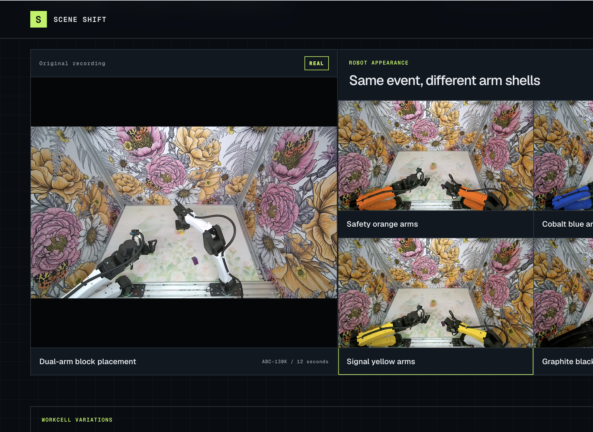

# Scene Shift

Scene Shift is a frontend prototype for reviewing controlled visual variations of real robot footage. It starts with one 12-second dual-arm manipulation clip, shows Reactor X2 generations beside their source, and separates automated visual review from human judgment.



*Prototype comparison view showing the real source beside controlled visual variations.*

## What the demo shows

- One source clip grouped with multiple generated outputs
- Arm appearance, background wall, and table surface variations
- Dedicated comparison pages with the original and generated clips side by side
- Shared play, pause, and seek controls for visual comparison
- Precomputed VLM verdicts labeled `PLAUSIBLE` or `DISCARD` where review is complete
- Human `ACCEPTED` or `DISCARD` decisions that can override the VLM review
- Human decisions and comments stored in the browser
- An optional in-app Reactor X2 generation flow

## Evidence boundaries

All generated results are RGB video candidates. `PLAUSIBLE` and `ACCEPTED` mean visually plausible relative to the source and requested variation. They do not establish physics correctness, telemetry alignment, executable robot actions, or training readiness.

This public repository contains the demo frontend, browser-ready showcase media, precomputed visual review data, and a minimal server-side token route for optional live generation. It excludes API credentials, private experiment archives, raw generation archives, internal prompts, and robot-data validation backends.

## Included review set and initial decisions

- Source: `original.mp4`
- Visual keeps: blue safety-panel walls and brushed-steel table
- Pending review: orange opacity repair and dark safety-mesh walls
- Discards: original orange, cobalt blue, signal yellow, graphite, light-gray lab walls, navy table, and walnut table

The discard reasons include transparent arm shells, incomplete recoloring, block or object drift, table artifacts, motion drift, and multiplied blocks.

## Run locally

Requires Node.js 22.13 or newer.

```bash
npm install
npm run dev
```

Open the local URL printed by the development server. The included showcase and review flow work without API credentials.

To enable the optional `Generate variations` flow, set a Reactor API key on the server:

```bash
REACTOR_API_KEY=your_key npm run dev
```

The key remains server-side. The token route exchanges it for a single-session JWT, and the browser receives the generated stream over WebRTC.

## Validate

```bash
npm run lint
npm run build
npm audit --omit=dev --audit-level=high
```

## Data and model attribution

- Source robot clip: [XDOF ABC-130K](https://huggingface.co/datasets/XDOF/ABC-130k)
- Video generation: [Reactor X2](https://www.reactor.inc/models/x2/api)

## Status

Scene Shift is a hackathon prototype, not a deployed service. No open-source license is included, so public access to this repository does not grant reuse rights beyond applicable law or separately licensed source assets.
